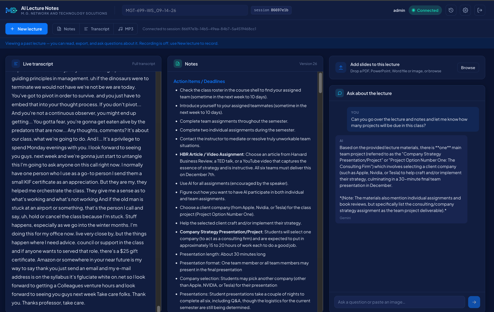
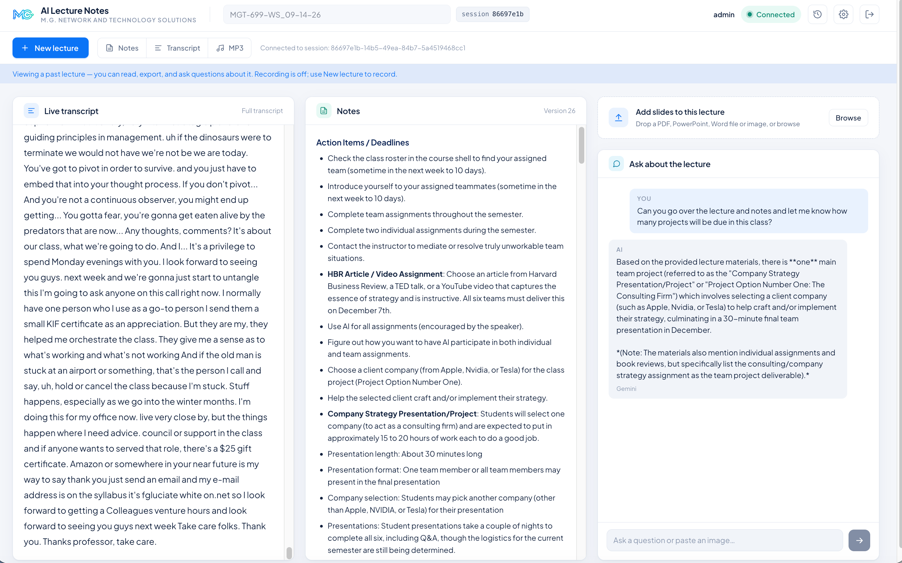
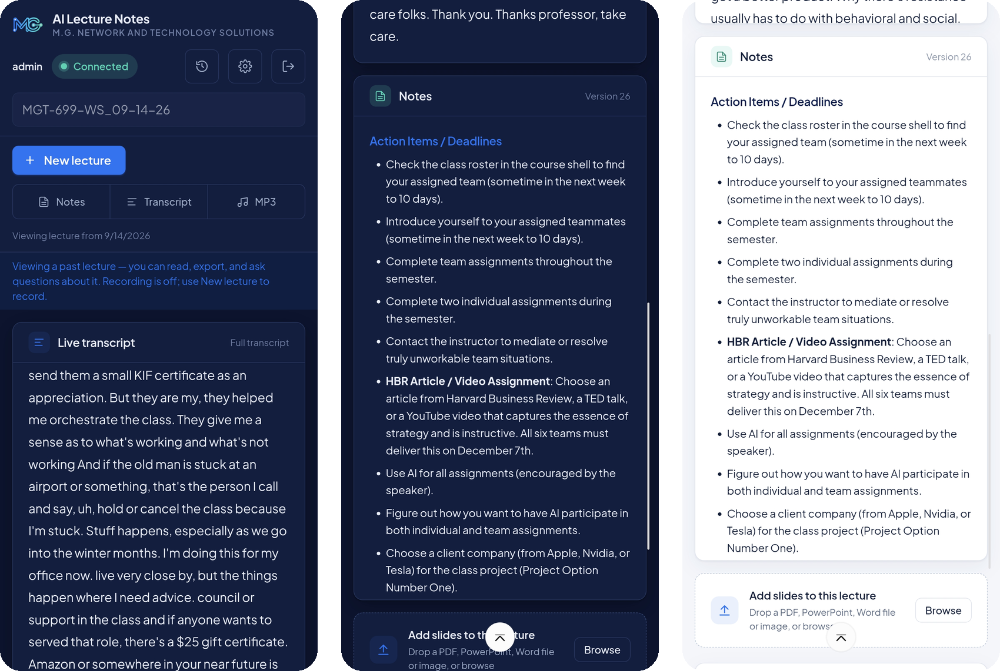
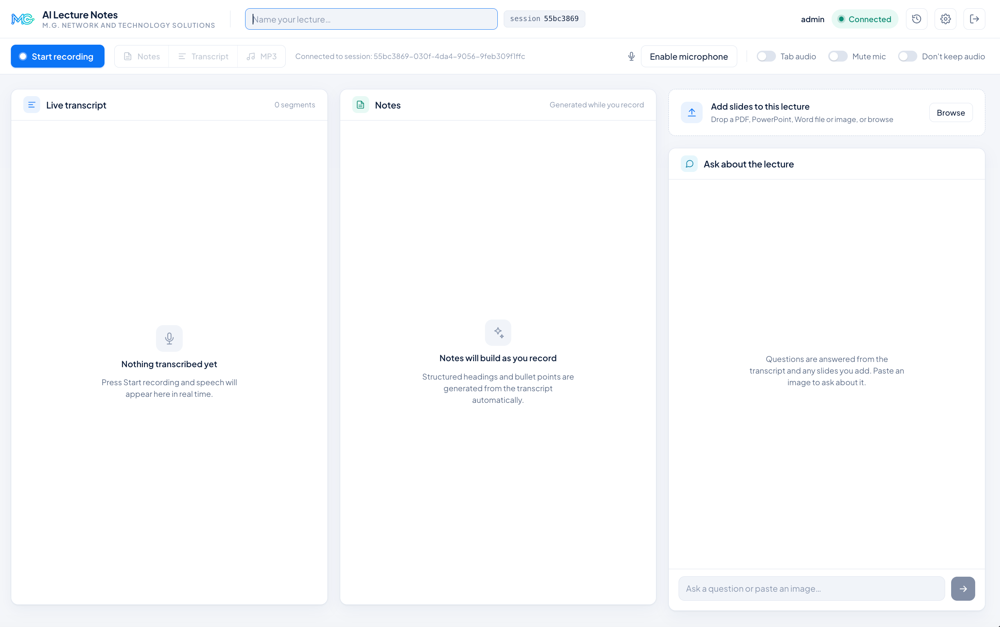
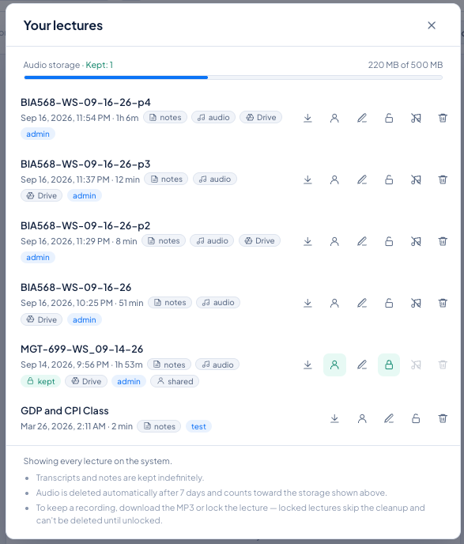
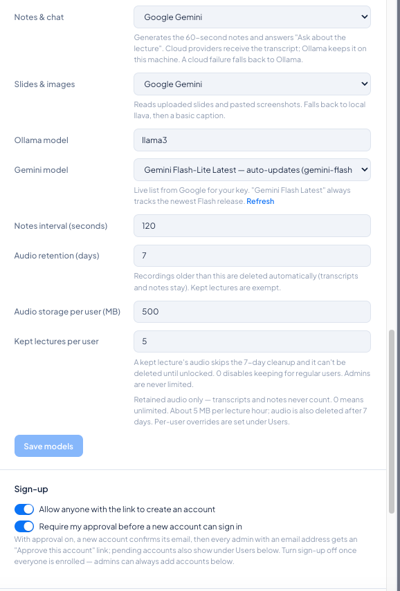
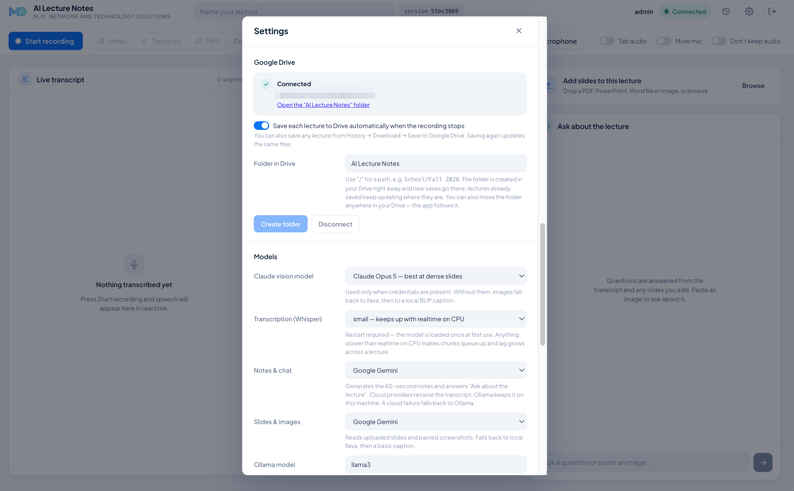
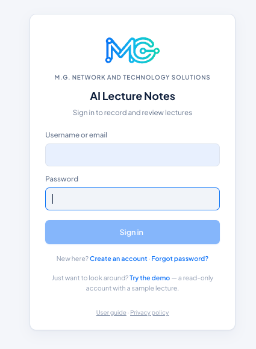
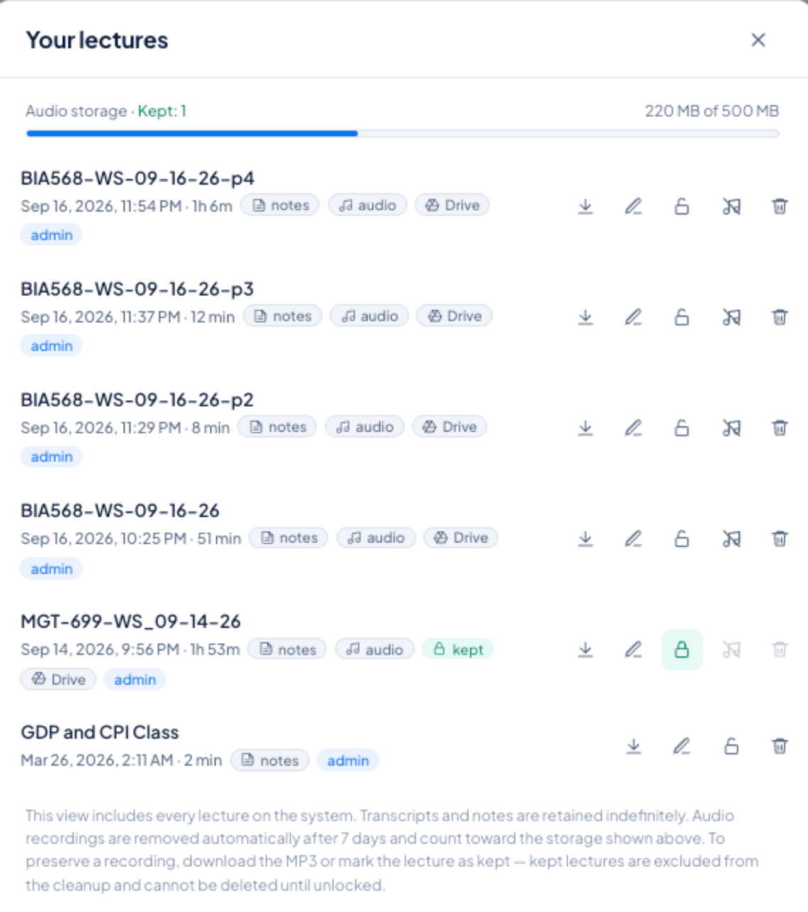

# AI Lecture Notes

[](https://github.com/mrgutierrezmario/lecture-note-app/releases)
[](https://github.com/mrgutierrezmario/lecture-note-app/actions/workflows/ci.yml)
[](LICENSE)
[](app/ui_backend)
[](app/ui_backend)
[](app/ui_frontend)
[](deploy)
[](app/ui_backend/pyproject.toml)

Record a lecture from your browser, watch the transcript appear live, and get
structured notes generated every minute — then ask questions about the lecture
afterwards. Everything runs on your own machine; cloud AI providers are
optional.

**By M.G. Network and Technology Solutions.**



<p align="center"><em>Transcript, generated notes, and "Ask about the lecture" — with a follow-up question. Dark mode; light mode below.</em></p>

| | |
|---|---|
| Transcription | [faster-whisper](https://github.com/SYSTRAN/faster-whisper) on CPU, live, 5-second chunks |
| Notes & chat | Local [Ollama](https://ollama.com) (default) — or Claude, Gemini or OpenAI via API key |
| Slides & images | Claude / Gemini / OpenAI vision, falling back to local llava |
| Accounts | Username or email sign-in; self-registration with email confirmation and optional admin approval; emailed password reset; admin role |
| Per user | Lecture history, per-user storage quota, "keep" up to 5 lectures from cleanup; exports as Markdown, text, PDF, Word and MP3 |
| Runs as | A Docker Compose stack (Postgres, MinIO, app) with a fixed public HTTPS URL via Tailscale Funnel — free, no domain needed |
| While recording | Pause/Resume, mute, tab audio, key terms for the transcriber, a focus for the notes; audio is buffered through disconnects |
| Afterwards | Edit or regenerate the notes; ask follow-up questions (chat is kept with the lecture); export as Markdown, text, PDF, Word or MP3 |
| Works on | Desktop browsers and phones (installable as a home-screen app; the screen stays awake while recording) |
| Your data | Nightly encrypted off-site backups with a scripted restore drill; users can keep their own copy of every lecture in their Google Drive |
| Operations | `/health` reports the database and storage for an uptime monitor (UptimeRobot works on the free tier), backup failures email you, container logs rotate, CI runs lint + tests on every push |

<details>
<summary><strong>More screenshots</strong> — light mode, phone, history, settings</summary>

<br>


<p align="center"><em>Light mode.</em></p>

<p align="center"></p>
<p align="center"><em>Installed as a home-screen app on a phone, in dark mode — the easier read on a small screen. Transcript and notes stack vertically.</em></p>


<p align="center"><em>Ready to record: name the lecture, pick a microphone, optionally capture tab audio or skip keeping the audio.</em></p>

<p align="center"></p>
<p align="center"><em>History: every lecture with its notes/audio/kept/Drive status, downloads, and the storage quota.</em></p>

<p align="center"></p>
<p align="center"><em>Admin settings: which provider does what, the notes interval, quotas and sign-up.</em></p>


<p align="center"><em>Each user can connect their own Google Drive.</em></p>

<p align="center"></p>
<p align="center"><em>Sign in with username or email; password reset by email; a read-only demo for visitors.</em></p>

</details>

---

## Contents

1. [How it works](#how-it-works)
2. [Quick start (development)](#quick-start-development)
3. [Production setup (Docker, one command)](#production-setup-docker-one-command)
4. [Public URL and phones](#public-url-and-phones)
5. [Accounts and roles](#accounts-and-roles)
6. [AI providers](#ai-providers)
7. [Recording tips](#recording-tips)
8. [Configuration reference](#configuration-reference)
9. [Storage, retention and quotas](#storage-retention-and-quotas)
10. [Backups](#backups)
11. [Google Drive for users](#google-drive-for-users)
12. [Project layout](#project-layout)
13. [Troubleshooting](#troubleshooting)
14. [Contributing](#contributing)

---

## How it works

```
Browser (React) ──WebSocket: 5 s WebM chunks──▶ FastAPI backend
                ◀── transcript segments, notes ──      │
                                                       ├─ ffmpeg → Whisper (CPU)      transcript
                                                       ├─ text provider (Ollama/…)    notes on an interval, chat
                                                       ├─ vision provider (…/llava)   slides & images
                                                       ├─ Postgres                    sessions, transcripts, notes, users
                                                       └─ MinIO (S3)                  audio chunks (deleted after N days)
```

- The browser records with `MediaRecorder` and streams 5-second chunks over a
  WebSocket. Each chunk is stored, transcribed, and its text pushed back
  immediately.
- On an interval (**Settings → Notes interval**, 60 s by default; 120 s is a
  good choice on free cloud tiers) the new transcript is sent to the text
  provider, which returns Markdown sections that are merged into the running
  notes.
- Uploaded PDFs/PowerPoint/Word files are text-extracted; images are read by a
  vision model. All of it becomes context for "Ask about the lecture".
- Audio is deleted after a configurable number of days — 14 by default,
  **Settings → Audio retention** — (transcripts and notes are kept) unless the
  user marks a lecture as *kept*.

---

## Quick start (development)

Runs the backend with auto-reload and the Vite dev server with hot reload.

### Prerequisites

- **Python 3.11+**, **Node.js 18+**, **ffmpeg** (`brew install ffmpeg` / `apt install ffmpeg`)
- **PostgreSQL** and **MinIO** — easiest via Docker: `docker compose up -d`
  (the root `docker-compose.yml` starts both with dev credentials and creates the bucket)
- **Ollama** with a model pulled: `brew install ollama && ollama pull llama3`
  (and `ollama pull llava` for local image reading)

### Steps

```bash
git clone <this repo> lecture-note-app && cd lecture-note-app

# Backend
cd app/ui_backend
python -m venv venv && source venv/bin/activate
pip install -r requirements.txt
cp .env.example .env            # defaults match the docker-compose dev services
(cd alembic && alembic upgrade head)   # create the tables

# First admin account
python -m scripts.manage_users create admin --admin      # prompts for a password

# Frontend
cd ../ui_frontend && npm install
```

Then start everything:

```bash
./start.sh        # Ollama → backend (:8000) → Vite (:5173), Ctrl+C stops all
```

Open http://localhost:5173, sign in as the admin you created, allow the
microphone, and press **Start recording**.

> The Vite dev server proxies `/api` and `/ws` to the backend, so there is no
> CORS setup. To test on a phone on the same Wi-Fi, use `npm run dev:https`
> (self-signed certificate — browsers only allow the microphone over HTTPS).

---

## Production setup (Docker, one command)

The production setup is a self-contained Docker Compose stack in `deploy/`:
Postgres, MinIO, the app (backend + built UI on one port), Tailscale for the
public URL, and optionally Ollama. Everything restarts on its own after a
reboot; all data lives in Docker volumes.

### Prerequisites

- Docker Desktop (Mac/Windows) or Docker Engine (Linux), with **≥ 8 GB** of
  memory available to containers
- A free [Tailscale](https://tailscale.com) account (for the public HTTPS URL)
- Optional but recommended on a Mac: Ollama installed natively for GPU speed
  (see [AI providers](#ai-providers))

### Steps

```bash
git clone <this repo> lecture-note-app && cd lecture-note-app
deploy/start.sh
```

`start.sh` is safe to re-run and does, in order:

1. Creates `deploy/.env` from `deploy/.env.example` with generated secrets
   (database and MinIO passwords, `SECRET_KEY`). Edit it afterwards if needed.
2. Builds the app image and starts all containers.
3. Pulls the Ollama models (bundled Ollama only).
4. Prints a **Tailscale sign-in link** the first time — open it, sign in with
   Google/GitHub/Microsoft, approve the device. Then enable Funnel once when
   prompted (`tailscale funnel --bg 8000` inside the container prints the link).
5. Creates the first admin account and prints its generated password.
6. Prints the public URL: `https://<TS_HOSTNAME>.<your-tailnet>.ts.net`.

Day-to-day:

```bash
deploy/start.sh                                  # after pulling new code: rebuild + restart what changed
deploy/stop.sh                                   # stop; data is kept
docker compose -f deploy/compose.yml logs -f app # follow the app log
docker compose -f deploy/compose.yml exec app python -m scripts.manage_users list
```

### Keeping it up after a reboot

- Every container is `restart: unless-stopped`, so once Docker is running the
  stack comes back by itself.
- On a Mac: set Docker Desktop to **start at sign-in**, and either enable
  automatic login or accept that a reboot needs one login at the keyboard.
- In the Tailscale admin console, open the machine and **Disable key expiry**
  so it never asks to re-authenticate.

### Knowing when it's down

`GET /health` needs no login and checks the database and object storage: it
returns `200 {"status":"healthy",…}` when both answer and `503 {"status":
"degraded",…}` when either doesn't (HEAD works too). Point any free uptime
monitor at it — [UptimeRobot](https://uptimerobot.com) on a 5-minute interval
is enough — and you get an email within minutes of an outage and another when
it recovers, including the case where Docker is up but Postgres died.

Two more things watch themselves: the nightly backup emails
`BACKUP_NOTIFY_EMAIL` if it fails, and Docker rotates container logs
(20 MB × 5 per service) so they can't fill the disk.

### Sizing (a 16 GB Mac mini is plenty)

| Process | RAM |
|---|---|
| Docker VM (app + Whisper + Postgres + MinIO + Tailscale) | ~3 GB in use; cap at 8 GB |
| Native Ollama, one model loaded | ~5 GB (llama3) |
| macOS | ~3.5 GB |

Measured on an M-series Mac mini: three simultaneous recordings keep up with
real-time transcription; a fourth falls behind. Moving notes to a cloud
provider frees the CPU for Whisper.

---

## Public URL and phones

Browsers only allow microphone access over **HTTPS** (or `localhost`), so a
phone needs a real HTTPS address. The stack uses **Tailscale Funnel**: free,
no domain to buy, a fixed `https://<name>.<tailnet>.ts.net` URL with a valid
certificate, unlimited bandwidth. Change the name with `TS_HOSTNAME` in
`deploy/.env` and re-run `deploy/start.sh` (the old URL stops working).

Alternatives: a Cloudflare Tunnel with your own domain, or any reverse proxy
with a certificate in front of port 8000 — the app doesn't care which.

**Phones:** open the URL in Chrome/Safari and use *Add to Home screen* for an
app icon. The first tap on *Enable microphone* or *Start recording* asks for
the mic. Phones cannot record the *other* side of a phone/Zoom call (the OS
gives the mic to the call) — put the call on speakerphone, record from a
second device, or on a computer use **Tab audio** to capture a Zoom window.

---

## Accounts and roles

Everyone signs in with a username **or** email and a password (bcrypt
hashed). Logins last 30 days.

| | Regular user | Admin |
|---|---|---|
| Record, live transcript, notes, chat, uploads | own lectures | same |
| History: open (read-only), rename, delete, delete audio, download | own lectures | all lectures, owner shown |
| Keep lectures (skip cleanup, block deletion) | up to 5 | unlimited |
| Storage quota (retained audio) | 500 MB default | sets per-user overrides |
| Accounts | self-register (if open), forgot password, change own email/password | manage users, approve sign-ups, reset passwords, close sign-up |
| Models, API keys, provider choice, limits | — | Settings |

- **Self-registration** is on by default and, with outgoing mail configured,
  new accounts must confirm their email address first. Under
  **Settings → Sign-up** you can also require **admin approval**: every admin
  with an email address gets a "New account request" message with a one-click
  approve link (pending accounts also show under Users with an Approve
  button), and the user is emailed when the account is active. Turn sign-up
  off entirely once your users are enrolled.
- **Forgot password** emails a single-use, one-hour link. It needs outgoing
  mail configured (`MAIL_*` in `deploy/.env`; a Gmail address with an App
  Password works well — use a dedicated `…donotreply@gmail.com` account so
  replies don't land in your inbox). Without mail, the link isn't offered and
  admins reset passwords from **Settings → Users**.
- **Sharing:** the person icon on a History row shares a lecture read-only
  with other accounts (pick a user, press Share; Remove revokes). They see it in their History,
  can read, ask their own questions and export; only the owner can change it.
- **Demo account (optional):** create a user with the *Demo* switch (Settings →
  Users) and share a lecture or two with it (History → the person icon). The
  sign-in page then offers **Try the demo** — a read-only look at those
  lectures: transcript, notes, questions (tighter usage caps), exports; no
  recording, uploads, Drive or settings changes, and demo chats aren't stored.
- Shell fallback: `python -m scripts.manage_users create|list|passwd|delete`.

---

## AI providers

Two jobs, each with its own provider selector in **Settings → Models**:

| Job | Options | Fallback chain |
|---|---|---|
| **Notes & chat** | Local Ollama (default, private) · Claude · Gemini · OpenAI | other cloud providers with a saved key → Ollama |
| **Slides & images** | Claude (best on dense slides) · Gemini · OpenAI · local llava | other cloud providers with a saved key → llava → BLIP caption |

Paste API keys under **Settings → API keys**; all three can be saved at once
and each job picks independently. A cloud failure (bad key, quota, outage)
cascades automatically: the chosen provider first, then any other cloud
provider you have a key for, then the local model — so a lecture never loses
its notes. Chat replies show which model answered and, when it was not the
one you chose, why. Saving a Gemini *and* a Claude key with Gemini selected
gives "Gemini first, Claude as backup".

- **Gemini** has a free, rate-limited tier — get a key at
  [aistudio.google.com](https://aistudio.google.com). The model dropdown is
  fetched live from Google, so it never goes stale; "Gemini Flash Latest"
  tracks the newest release automatically.
- **Claude** and **OpenAI** need prepaid API credits (a chat subscription is
  not API access).
- **Privacy note:** with a cloud provider selected, lecture transcripts are sent
  to that provider. Local Ollama keeps everything on your machine.

### Native Ollama on a Mac (recommended)

Docker cannot use Apple's GPU, so the bundled Ollama runs on CPU. A native
install uses Metal and is faster, and frees the CPU for transcription:

```bash
brew install ollama
brew services start ollama          # or use deploy/mac/com.mgnetwork.ollama.plist (see inside)
ollama pull llama3 && ollama pull llava
```

then set `OLLAMA_BASE_URL=http://host.docker.internal:11434` in `deploy/.env`
and re-run `deploy/start.sh`. On a 16 GB machine, the launch agent in
`deploy/mac/` keeps only one model in memory at a time.

---

## Recording tips

| Control | What it does |
|---|---|
| Microphone dropdown | Which input to record. A virtual device (e.g. BlackHole on macOS) captures system audio |
| Tab audio | Also record a browser tab (Zoom in a browser, a video) alongside the mic — desktop only |
| Pause / Resume | Freeze the recording during a break; the lecture stays open (no final notes, no export until Stop) |
| Mute | Silence the selected input without stopping the recording; the switch names the device it silences (with BlackHole selected that is the meeting audio, not you — use Zoom's mute for yourself) |
| Don't keep audio | Transcribe without storing the recording: no MP3 later, no quota used |
| **Aa** (Lecture details) | Key terms (names, acronyms) the transcriber should spell right, and a focus the notes should emphasise; editable during the lecture |
| Continue recording | After a Stop, keep recording into the same lecture |
| Keep (lock) in History | Exempt a lecture from the audio cleanup and from deletion |

**Zoom on macOS:** setting Zoom's speaker to BlackHole silences your own
output. Create a *Multi-Output Device* in Audio MIDI Setup containing both
your speakers and BlackHole, set it as the system output, and pick BlackHole
as the app's microphone.

The app warns after 15 seconds of digital silence (typically the OS holding
the mic for a call). If the connection drops mid-lecture — or the server
restarts — the browser keeps recording and buffers the audio (up to 30
minutes), then sends it in order when the link is back; nothing is lost. On
phones the screen is kept awake while recording.

**Notes:** they build every notes interval; edit them in place afterwards (the
pencil — saved as a new version that later passes build on) or regenerate them
from the whole transcript with the current focus (the sparkle, when not
recording). The live transcript follows along only while you are at the
bottom; scroll up to re-read and a "Jump to latest" pill appears instead.

**Exports:** notes (Markdown) and transcript (text) download immediately;
**PDF** and **Word** build one formatted document — notes, the questions you
asked with their answers, and the transcript in 30-second paragraphs with
times; the MP3 is assembled on the server first — the button shows progress,
and the finished file is cached for 30 minutes so a repeat download is instant.

**Which model answered:** every chat reply shows the provider under it, and
in amber when a cloud provider failed and the local model answered instead
(quota exceeded, overloaded, no credits…). The status line reports the same
for notes.

---

## Configuration reference

Production config lives in `deploy/.env` (created by `start.sh`); development
config in `app/ui_backend/.env`. Everything not listed has a sensible default
in `app/ui_backend/core/config.py`. Settings marked *panel* can also be changed at
runtime from the admin Settings panel and persist in the app-state volume.

| Variable | Default | Purpose |
|---|---|---|
| `SECRET_KEY` | generated | Signs login cookies; changing it signs everyone out |
| `POSTGRES_PASSWORD`, `MINIO_ROOT_PASSWORD` | generated | Internal service credentials |
| `TS_HOSTNAME` | `lecture-notes` | First part of the public URL |
| `TS_AUTHKEY` | — | Optional Tailscale auth key to skip the interactive sign-in |
| `APP_PORT` | `8010` | Local port on the host for `http://localhost:<port>` |
| `OLLAMA_BASE_URL` | bundled | Point at a native Ollama: `http://host.docker.internal:11434` |
| `OLLAMA_MODEL` *(panel)* | `llama3` | Local notes/chat model |
| `WHISPER_MODEL` *(panel, restart)* | `small` | `base` is faster, `medium`/`large-v3` more accurate but slower than real time on CPU |
| `NOTES_INTERVAL_SECONDS` *(panel)* | `60` | How often notes regenerate |
| `STORAGE_QUOTA_MB` *(panel)* | `500` | Retained audio per user (0 = unlimited) |
| `MAX_LOCKED_LECTURES` *(panel)* | `5` | Kept lectures per regular user (admins unlimited) |
| `MAX_UPLOAD_MB` | `50` | Largest document/image upload |
| `AUDIO_RETENTION_DAYS` *(panel)* | `14` | Audio deleted after this many days (Settings → Audio retention) |
| `WHISPER_LANGUAGE` *(panel)* | `en` | Transcription language code, or `auto` to detect per chunk |
| `WHISPER_VOCABULARY` *(panel)* | — | Server-wide spelling hints (names, course codes) fed to Whisper |
| `REGISTRATION_OPEN` *(panel)* | `true` | Whether the sign-in page offers "Create account" |
| `REGISTRATION_APPROVAL` *(panel)* | `false` | New accounts wait for an admin's approval (admins are emailed a link) |
| `MAIL_USERNAME`, `MAIL_PASSWORD`, `MAIL_FROM`, `MAIL_REPLY_TO` | — | SMTP (Gmail App Password) for account emails |
| `PUBLIC_URL` | — | Base URL used in emailed links and the Google Drive redirect |
| `SUPPORT_EMAIL` | — | Contact shown on the privacy page (`/privacy`) |
| `BACKUP_NOTIFY_EMAIL` | — | Gets an email when a nightly backup fails |
| `GOOGLE_CLIENT_ID` *(panel)*, `GOOGLE_CLIENT_SECRET` *(panel)* | — | OAuth client for users' Google Drive (Settings → API keys) |
| `GOOGLE_PICKER_API_KEY` *(panel)* | — | Optional: the Google Drive folder selector (users pick an existing folder with Google's chooser) |
| `SESSION_DAYS` | `30` | Login cookie lifetime |

API keys (`ANTHROPIC_API_KEY`, `GEMINI_API_KEY`, `OPENAI_API_KEY`) are entered
in the Settings panel and stored in the app-state volume; leave them out of
`deploy/.env` (an empty value there would shadow the saved key).

---

## Storage, retention and quotas

- **Audio** is stored in MinIO as 5-second WebM chunks (~5 MB per lecture-hour)
  and deleted after `AUDIO_RETENTION_DAYS`. **Transcripts and notes are kept
  indefinitely.**
- Each user has a **quota** on retained audio. Over quota, a new recording is
  refused with an explanation (they can still record with *Don't keep audio*);
  if the quota fills mid-lecture, the transcript continues and only the audio
  stops being kept. Users free space by deleting a lecture's audio (keeping its
  transcript) from History.
- **Kept** lectures are exempt from cleanup and cannot be deleted until unlocked.
- A cleanup pass runs every 24 h; trigger one manually with
  `POST /api/admin/cleanup_audio` (admin).

---

## Backups

Everything worth keeping is small — the database (users, transcripts, notes,
history) is a few MB, the audio a few hundred MB — so a nightly copy costs
nothing. Two scripts, no extra services:

```bash
deploy/backup-setup.sh        # one time: off-site copy + nightly schedule
deploy/backup.sh              # what the schedule runs (safe to run any time)
deploy/restore.sh latest      # put it all back
```

**What a backup contains** (`deploy/state/backups/`, git-ignored):

| | |
|---|---|
| `daily/lecture-notes-DATE.tar.gz` | Postgres dump, `deploy/.env`, the saved settings/API keys, the Tailscale identity. 14 kept. |
| `weekly/` | Sunday's bundle, 8 kept |
| `audio/` | mirror of the audio bucket — only new chunks are fetched each night, chunks retention deleted are removed |

**Off-site (recommended):** `deploy/backup-setup.sh` connects
[rclone](https://rclone.org) to a Google account (a browser window opens; a
dedicated account is a good idea — the app only gets access to files it
creates itself), wraps it in an **encrypted** remote so nothing readable ever
leaves the machine (file names included), schedules the backup nightly at
03:00 (launchd on macOS, a printed cron line on Linux) and runs the first one.
It prints a **passphrase once** — store it in a password manager; it is what
lets you decrypt the backups if the machine is gone. Any rclone-supported
destination works instead of Google Drive (Dropbox, OneDrive, S3, Backblaze
B2, a USB drive): create the remote yourself and point `RCLONE_REMOTE` in
`deploy/.env` at it.

**Restoring:**

- *Same machine, after a bad day:* `deploy/restore.sh latest` (or a specific
  `daily/…tar.gz`). It replaces the database and settings with the backup and
  re-uploads the audio — it asks before doing so.
- *New machine:* install Docker and rclone, clone the repository, run
  `deploy/backup-setup.sh` (same Google account; enter the saved passphrase
  when asked instead of generating a new one), then
  `deploy/restore.sh --from-remote latest`. You get the same accounts,
  lectures, settings and — because the Tailscale identity is restored — the
  same public URL.

**Prove it works:** `deploy/restore-drill.sh` restores the newest bundle into a
throwaway stack on the same machine (own volumes, port 8020, never touches the
live app), checks that accounts, lectures, settings and audio came back and the
app is healthy, and removes it again. `--from-remote` fetches the off-site copy
first — the path a real recovery would take. Run it now and then.

Set `BACKUP_NOTIFY_EMAIL` in `deploy/.env` to get an email (through the app's
own mail account) whenever a nightly backup fails. The log is
`deploy/state/backups/backup.log`.

---

## Google Drive for users

Each user can connect their **own** Google Drive from Settings and keep a
copy of every lecture there: an "AI Lecture Notes" folder (or any path they
choose, e.g. `School/Fall 2026`) with one subfolder per lecture holding
`notes.md`, `transcript.txt` and `recording.mp3`. Saving happens
automatically when a recording stops (switchable) or on demand from
History → Download → **Save to Google Drive**; saving again updates the same
files. The app asks Google only for the `drive.file` permission, so it can
see nothing in the user's Drive except the files it created.

**One-time setup (admin)** in [Google Cloud console](https://console.cloud.google.com):

1. Create a project and enable the **Google Drive API** (APIs & Services → Library).
2. **Google Auth Platform → Branding**: app name, support email, developer
   contact. Skip the logo (a logo forces Google's verification review) and
   leave the domain fields empty unless you own the domain.
3. **Audience**: External. While it says *Testing*, only listed **test users**
   can connect — add yourself to try it, then **Publish app** so anyone can.
   With only the `drive.file` scope there is no verification review.
4. **Clients → Create client**: type **Web application**, authorised redirect
   URI `https://<your host>/api/drive/callback` (Settings shows the exact
   value). Paste the Client ID and secret into **Settings → API keys → Google
   Drive (OAuth client)**.

### Folder selector (optional)

By default users type a folder name and the app creates it. With the folder
selector they can instead pick a folder that already exists in their Drive,
through Google's own chooser dialog — and the app is granted access to just
that folder (the `drive.file` permission stays as narrow as before). It needs
an API key, in the same Cloud project as the OAuth client:

1. **Enable the API:** APIs & Services → Library → search **Google Picker API**
   → Enable.
2. **Create the key:** APIs & Services → Credentials → **+ Create credentials
   → API key**. Give it a name such as `Lecture Notes Picker`.
3. **Restrict it** (the key is visible in the browser by design, so make it
   useless anywhere else): open the key → *Application restrictions* →
   **Websites** → add `https://<your host>/*` · *API restrictions* →
   **Restrict key** → tick **Google Picker API** only → Save.
4. **Paste it into the app:** Settings → API keys → **Google Drive folder
   selector** → *Folder selector API key* → Save.

Users then see **Choose existing folder…** next to *Create folder* under
Settings → Google Drive. When they pick one, the app records it, shows its name
in *Folder in Drive*, and new saves go there.

How it works: the browser asks the server for a short-lived access token for
the user's own Drive (`GET /api/drive/picker-token`) and opens the picker with
that token, the API key and the app id (the Cloud project number, which is
the first part of the OAuth client id). Google ties the chosen folder to the
app, so it can be read and written under `drive.file`; the server then
confirms it can see the folder and saves its id.

Refresh tokens are stored encrypted with `SECRET_KEY`; disconnecting revokes
them at Google.

---

## Project layout

```
app/ui_backend/           FastAPI backend — main.py wires it up and serves the built UI
  core/                   config, database session, ORM models, API schemas, runtime settings
  accounts/               auth (passwords, signed cookies, middleware), rate limiting
  ai/                     transcriber (ffmpeg + Whisper), notes_generator (extract → merge),
                          providers (Ollama / Claude / Gemini / OpenAI behind one interface),
                          image_analyzer, document_processor
  storage/                s3_client, quota, cleanup (retention), audio_backup (for backup.sh)
  exports/                documents_export (PDF / Word), mp3_export
  integrations/           google_drive (OAuth + uploads), mailer
  realtime/               websocket_handler — the recording socket: chunks in, transcript/notes out
  routes/                 API routers: sessions, history, auth, settings, drive, admin
  scripts/                manage_users — CLI for accounts
  alembic/                schema migrations (applied on startup)
  tests/                  pytest suite
app/ui_frontend/          React + Vite frontend (src/components, src/hooks)
deploy/                   compose.yml, Dockerfile, start.sh/stop.sh,
                          backup.sh/restore.sh/restore-drill.sh/backup-setup.sh, mac/ launch agents
```

Backend code is formatted and linted with [ruff](https://docs.astral.sh/ruff/)
(`app/ui_backend/pyproject.toml`): `venv/bin/ruff format . && venv/bin/ruff check .`.

**Tests:** `app/ui_backend/tests/` — pure-Python unit tests (auth tokens, rate
limiting, notes merging, WebM header slicing, Whisper prompt, Drive helpers,
settings validation, provider cascade) plus API smoke tests that need no
database. Run with `pip install -r requirements-dev.txt && python -m pytest`
from `app/ui_backend`. GitHub Actions runs lint, tests and the frontend build
on every push and pull request.

---

## Troubleshooting

| Symptom | Cause / fix |
|---|---|
| "Microphone needs HTTPS" | Phones and remote browsers require HTTPS; use the Tailscale URL or `npm run dev:https` |
| Mic blocked in the installed phone app | Long-press the app icon → App info → Permissions → Microphone → Allow |
| Transcript lags behind | Too many simultaneous recordings, or Whisper model too large for the CPU — use `small` |
| Notes never appear | The first pass runs one notes interval (60–120 s) after recording starts; check **Settings → Models** for the active provider and the app log (`docker compose … logs app`) |
| Ollama "killed" / notes fall back to heuristics | Not enough memory to load the model — raise Docker's memory or use a smaller model |
| Gemini "model not available" | Google retired that model name; pick another from the dropdown (or "Gemini Flash Latest") |
| Empty Gemini answers (`MAX_TOKENS`) | Handled automatically (thinking is disabled per model); update if it recurs |
| Password reset email never arrives | `MAIL_*` unset, or the Gmail App Password was revoked — re-create it |
| Recording during a phone/Zoom call captures silence | The OS gives the mic to the call; use speakerphone or Tab audio on a computer |

---

## Versions and releases

The version lives in the `VERSION` file at the repository root — the backend,
the frontend build and `/health` all read it, and Settings shows it in the
footer. Releases are git tags (`v1.0.0`) with notes on the
[Releases](https://github.com/mrgutierrezmario/lecture-note-app/releases)
page; [CHANGELOG.md](CHANGELOG.md) keeps the history. Semantic versioning:
patch for fixes, minor for features, major for breaking changes.

To cut a release: bump `VERSION` and `app/ui_frontend/package.json`, add a
CHANGELOG section, commit, then `git tag vX.Y.Z && git push --tags` and
create the release on GitHub from the tag.

---

## Contributing

Issues and pull requests are welcome. Before opening a PR:

```bash
cd app/ui_backend && venv/bin/ruff format . && venv/bin/ruff check .   # must pass (includes docstring checks)
cd ../ui_frontend && npm run build                                                 # must build
```

Never commit `.env` files, `deploy/.env`, or anything under `deploy/state/`
(all git-ignored). API keys belong in the Settings panel, not in the repo.

## How it was built

Designed, specified and operated by Mario Gutierrez (M.G. Network and
Technology Solutions), and developed with [Claude Code](https://claude.com/claude-code)
as a pair-programming assistant (commits up to v1.0.0 carry a `Co-Authored-By`
line). Every feature was driven by real use: recorded lectures, the problems
they surfaced, and the fixes that followed.

### Timeline

It didn't start as any of this. The first version, in January 2026, was a
voice recorder: press record, get a transcript, get some notes from a local
model. Using it in a real classroom every week for six months is what turned
it into what's here today — each feature below exists because a lecture
showed it was missing.

This repository's history starts on 2026-09-14, when the project went public
and the earlier history — which contained personal details and development
noise — was squashed into one commit. The project itself is older:

| When | What |
|---|---|
| **January 2026** | First prototype: browser recording, Whisper transcription, Ollama notes, Postgres + MinIO |
| **March 2026** | First real lectures recorded (a graduate management course); WebSocket streaming, mute, downloads, live-class fixes |
| **April 2026** | Claude for slides and images, audio-drop and dual-socket fixes, one-command startup script |
| **May – August 2026** | In daily use for the course; running notes on what worked and what didn't |
| **September 2026** | Production hardening from that list: Docker stack, public HTTPS URL, accounts, backups, Google Drive, PDF/Word exports, monitoring, tests + CI, docs — released as **v1.0.0** on 2026-09-19 |

Roughly eight months from first commit to release, with six months of use in
between.

<p align="center"></p>
<p align="center"><em>History as of September 2026: from the first recorded class in March to the current course.</em></p>

## License

[PolyForm Noncommercial 1.0.0](LICENSE) — © 2026 M.G. Network and Technology Solutions.

Free to use, modify and share for **noncommercial** purposes: personal study,
research, hobby projects, and use by educational institutions, charities and
other noncommercial organizations. **Commercial use requires a separate
license** — contact the copyright holder.
